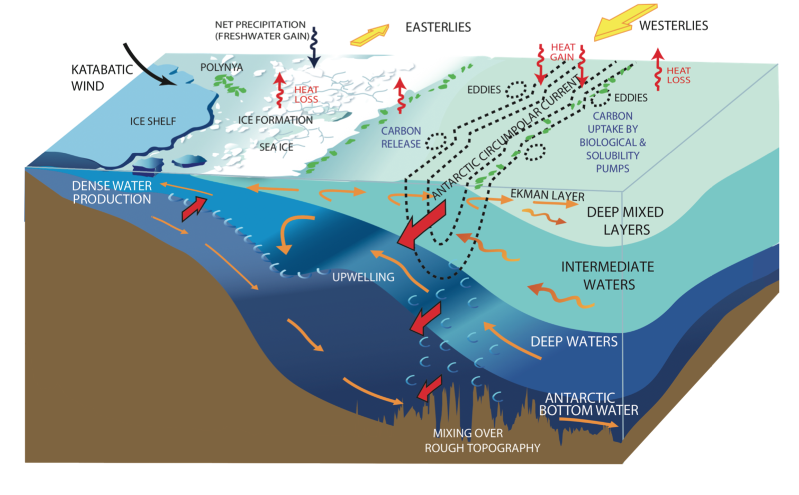

## Illustration n°2 : Etude des intéractions entre océan sub-polaire austral et calotte antarctique {.page_break_before}

Ce chapitre présente une deuxième illustration de mes activités de direction de recherche. Il est essentiellement basé sur des travaux menés entre 2014 et 2018 dans le cadre de la thèse de Nacho Merino [@tag:these-nm], et poursuivi en collaboration avec des collègues glaciologues de l'IGE. 

### Contexte scientifique

#### La zone subpolaire de l'ocean austral. 

Le terme *ocean austral subpolaire designe*...

Caracterisé par interaction avec la cryosphere. 

Avec la glace de mer d'une part. role important de modulation des flux de flottabilioté. 

Avec la calotte antarctique d'autre part, en particulier dans les zones d'*ice-shelves*.  circulatiopn sur les plateaux et dans les cavités. 

contribution importante au niveau des mer. mais également cle pour l'ocean global.  

{#fig:subpolar-processes width=80%}

#### Des changements rapides dans la zone antarctique

changement dans proriétés des masses d'eaux : Purkey et Jonhson 2013 [@doi:10.1175/JCLI-D-12-00834.1] [@fig:purkey-johnson-2013]. etc... Freshening and warming of Antarctic Bottom Water (AABW) (Johnson et al., 2008) (Purkey and Johnson, 2013) Volume, contraction : Contraction of AABW (Purkey and Johnson, 2012). (van Wijk and Rintoul, 2014).

Notable changes in hydrographic properties are also observed in the polar Southern Ocean, but these changes are generally more regionally contrasted. overall. freshening. Warming of antarctic coastal waters , esp. western Antartic Peninsula (Meredith, 2005) warming over shelves. changes in stratification. The observations show that surface freshening of the southern polar ocean since the 1950s has considerably enhanced the salinity stratification.

changement de la glace de mer. cf chapitre precedent. changement reflete en fait changemeent de saisonnalité : [@doi:10.1371/journal.pone.0064756] The regional changes in SIC reflect changes in the duration of the sea-ice season (Stammerjohn et al., 2008). et aussi thickness : changes in sea ice thickness are weakly constrained because dataset are just emerging, short time series (Kurtz and Markus, 2012; Lindsay, R., 2013); on long time scale require model-based reconstruction (Massonnet et al., 2013; Holland et al., 2014)  [@doi:10.1016/j.ocemod.2013.01.003] still very uncertain.

changement dans la calotte 

changement des vents. 

![*Flux d'eau douce équivalent aux changements de salinité observé dans les eaux abyssales entre les années 1980 et les années 2000 (reproduit de [@doi:10.1175/JCLI-D-12-00834.1])*](images/04_purkey-johnson-2013.png){#fig:purkey-johnson-2013 width=90%}

#### Interactions et couplage dans la zone antarctique 

Echange d'eau douce et de chaleur entre les differentes composantes : impact clés sur leur evolution. 

Changes in freshwater forcing from sea-ice and glacial ice to the Southern Ocean are also likely playing a role in on-going trends. 

Changes in surface winds, glacial freshwater input, and antarctic sea-ice are also partly interrelated.  cf spence. 

Ex: flux eau douce et evolution des propriété des masses d'eaux : Role des échanges d'eau douce dans dans la formation de masses d'eaux

Ex : Flux d'eau douce et tendance de glace de mer.  via impact sur la stabilité des couches superficielles et resultats en situation de formation de glace de mer. Bintanja vers Swart and Fyfe cf slides de Nacho

Ex : flux de chaleur et fonte des calotte. hypothèse  intrusion eau chaude. réponse de l'ocean affecte les calottes et en retour l'ocean. 

Particulierement important à cause de l'effet d'arc-boutant.  mecanisme de marine ice-sheet instability. acceleration de la debacle. 

mais pas encore de modele couplé au moment du démarrage de ce trravail. 

![*Tendance observée de concentration de glace de mer entre 1980 et 2008 (reproduit de [@doi:10.1016/j.ocemod.2013.01.003])*](images/04_obs-trend-sea-ice.png){#fig:massonnet-2013 width=50%}

### Positionnement et approche générale

Cette phase de travail a été initiée suite aux sollicitations des collègues glaciologues du LGGE vers 2012 et en particulier de G. Durand. Un faisceau convergeant d'élements indiquaient en effet qu'une part essentielle de l'incertitude quant à l'évolution future de la calotte antarctique était liée aux interactions avec l'océan et au processus de fonte dans les cavités d'ice-shelve. A leur yeux, meilleur comprhension physique des processus impliqués dans la fonte et vers une représentation explicite du couplage étaient donc le chemin naturel. 

Conscient du fait qu'en retour une part importante de l'incertitude sur l'évolution de l'ocean et de la glace venait des interaction avec la caoltte. Un cycle de discussion pour positionner de maniere optimale un travail à l'interface de nos équipes. Afin de définir une approche exploitant au mieux le potentiel spécifique de chacun de nos équipes et original par rapport à l'existant.  

convergé sur une thèse comme étape preparatoire au couplage , regard sur chaque composante sans représentation explicite du couplage. appuyé sur outils existant. du point de vue ocean, focus impact des flux d'eau douce sur glace de mer. estimation et représentation de flux. recent developpement du module d'ICB dans NEMO. 

C'est ainsi qu'a démarré la thèse de Nacho Merino [@tag:these-nm]. Au fil du projet recrutement de N. Jourdain et dev UKMO cavité iceshelves. basé sur des contributions techniques d'autres groupes. Démarrage ANR 3-AS. contexte très propice. et thématique porteuse bien que compétitive.  

### Principaux résultats scientifiques obtenus

#### Estimation du flux de fonte liés aux icebergs

Une premiere contribution [@doi:10.1016/j.ocemod.2016.05.001]. Simulation ocean / glace de mer avec modèle d'ICB, estimation du flux de fonte et qualification de l'impact de ce flux sur la glace de mer. 

Une part importante du travail : choix des sources d'information pour different contribution flux d'eau douce et leu distribution. Pour une large part basé sur [@doi:10.1038/nature12567]. 

travail spécifique sur la prise en compte du cisaillement vertical dans la dynamique des iceberg. evaluer en comparaison aux estimation de trajctoire par altimétrie satellitaire. 

fonte tres saisonniere, distribution tres organisé par basin. impact net sur la concentration et epaisseur de glace de mer tout autour de l'antarctique. augmentationde la production de glace enb automne et hiver. car augmentation de la stratification. sauf dans region Bellingshausen.  

L'un des apports de cette étude. distribution d'unutile pour modele sans composante ICB.  comme par exemple [@doi:10.1016/j.ocemod.2018.07.002]. regulierement mise à jour par N. Jourdain depuis. 

![*climatologie du flux d'eau douce lié au iceberg de l'ocean austral (reproduit de [@doi:10.1016/j.ocemod.2016.05.001])*](images/04_fresh-water-flux-icebergs.png){#fig:fwf-icebergs width=90%}

#### Impact des changements de flux d'eau douce sur la glace de mer 

basé sur [@doi:10.1016/j.ocemod.2017.11.009]

un scenario aux petits oignons.

importance relative des changement atmosphereique versus flux de fonte sur changementd de glace de mer. 

un mecanisme de réponse spécifique dans la zone Admunsen. 

![*Estimation dec changement de concentration de glace de mer associé aux...  (reproduit de [@doi:10.1016/j.ocemod.2017.11.009])*](images/04_sea-ice-drivers.png){#fig:drivers-sic-changes width=90%}

### Activités connexes, conséquence directes et indirectes

Amelioration de la représentation des interaction icebergs ocean dans ICB : [@doi:10.5194/gmd-8-1547-2015] clef dans d'autre secteur [@doi:10.1029/2018GL077676]

Poursuite des collaborations dans le secteur Admunsen : [@doi:10.1002/2016JC012509; @doi:10.1002/2017JC013059; @doi:10.1016/j.ocemod.2018.11.001]

[@tag:these-nm]: url:https://tel.archives-ouvertes.fr/tel-01760438
