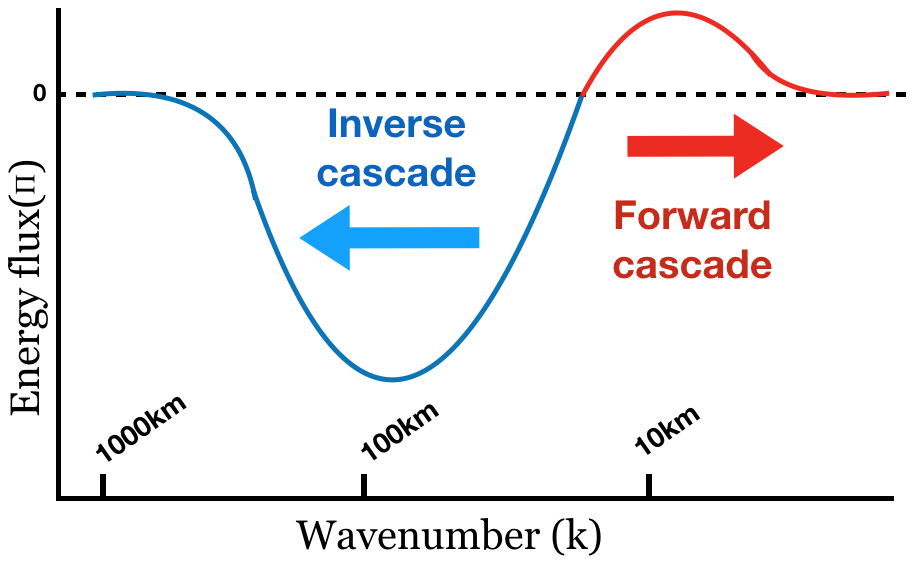

## Illustration n°3 : Etude de interactions d'échelles dans l'Ocean Atlantique Nord  {.page_break_before}

Ce chapitre présente est une troisième illustration de mes activités de direction de recherche. Il est essentiellement basé sur des travaux menés entre 2016 et 2020, notamment dans le cadre de la thèse d'Adekunle Ajayi [@tag:these-aj] et du projet SWOT Science Team (2016-2019) de l'équipe MEOM que j'ai co-animé avec Emmanuel Cosme. Les travaux présentés ci-dessous portent sur l'étude des échanges d'énergie cinétique entre échelles aux latitudes moyennes; ils ont été menés sur la base de simulations numériques de la circulation de l'Océan Atlantique Nord menées en préparation à la mission SWOT. 

### Contexte scientifique

#### Circulation océanique, energie cinétique et dissipation à micro-échelle

Le mélange irréversible à micro-échelle (1mm-1m) est un parametre clé controlant la circulation océanique [@doi:10.1017/CBO9780511801198]. C'est pourquoi son étude concentre l'attention d'une fraction importante des océanographes physiciens. De nombreuses avancées mais il n'en demeure pas moins un problème encore ouvert [@doi:10.1146/annurev.earth.32.071603.152635,https://doi.org/10.1175/JPO-D-15-0244.1]. Du point de vue pratique, représentation du mélange est une source d'incertitude irreductible des composantes oceaniques des modèles de circulation océqnique utilisé pour les projections climatiques [@doi:10.1002/qj.3397].     

A cause de la nature turbulente des écoulements oceaniques, le mélange irréversible à micro-echelle est intrinsequement lié à la circulation de plus grande échelle (macroturbulence), et au mélange turbulent qu'elle induit. Ainsi si la circulation depend du mélange irreversible le mélange irreversible depend lui même de la circulation et des échanges d'energie cinétique entre les echelles et de sa dissipation. Efforts pour fermer l'energetique des modeles de circulation océnique [@doi:10.1016/j.ocemod.2016.02.005;@doi:10.1175/JPO-D-16-0086.1].    

Fermer l'energétique c'est d'abord identifier sources et des puits d'énergie mécanique. principale source d'energie cinétique alimentant la circulation oceanique est lié au vent [@doi:10.1146/annurev.fluid.40.111406.102139]. Cette énergie cinétique est ensuite échangée entre les échelles, mettant ainsi in-fine en mouvement des echelles de 1cm à 10000km. Environ 10% de cette energie est dissipée dans les couches de surface, le reste est dissipé au fond [@doi:10.1038/ngeo1657] une faible fraction dans l'océan interieur, grande incertitude quant aux processus impliqués.

#### Le sort de l'energie cinétique de méso-échelle

Le plus gros réservoir d'energie cinétique aux échelles de temps superinertielles :  la dynamique de mesoechelle [@doi:10.1146/annurev.fluid.36.050802.122121], a donc recu beaucoup d'attention. tourbillons et fronts essentiellement geostrophiques. Faible nombre de Rossby et nombre de Froude. resulte de l'instabilité barocline des grands systemes de courants mis en mouvement par les vents de surface [@doi:10.1017/9781107588417].  Echelle typique de quelque rayon de Rossby barocline (~50km à 300km, voir par exemple [@doi:10.1146/annurev.fluid.40.111406.102139]).

![*Estimation de l'energie cinétique de surface [(cm.s$^{-1}$)$^2$] associée à la circulation géostrophique. L'énergie cinétique est ici multipliée par $\sin^2 \varphi$ où $\varphi$ désigne la latitude (source: [@doi:10.1146/annurev.earth.26.1.219]). *](images/05_geostrophic-KE-distribution.png
){#fig:ke-distrribution width=80%}

Comprendre le sort de l'énergie cinétique de meso-échelle est donc clé. On le fait avec une combinaison d'observation altimétrique, de modeles analytiques theorique et de modèles réalistes. Role essentiel joué par l'atimetrie : comprendre la distribution [@doi:10/csd3g6] et les échanges non-lineaire [@doi:10.1175/JPO2771.1; @doi:10.1029/2017JC013516]. De même les modeles theoriques [@doi:10/fw9pdr;@doi:10.1175/JPO3027.1;@doi:10.1175/2011JPO4404.1] et modeles réalistes [@doi:10.1029/2006GL027813;@doi:10.3390/fluids2030045;@doi:10.1175/JPO-D-19-0034.1].

Le consensus actuel sur ces questions est qu'on observe effectivement une intense cascade inverse d'energie cinétique depuis les échelles d'injection liées à l'instabilité barocline [@doi:10.1175/JPO2771.1; @doi:10.1029/2018EA000492] et que cette cascade inverse se traduit également dans le domaine temporel [@doi:10.1175/JPO-D-17-0136.1]. La rationalisation théorique de ce processus de cascade inverse est encore imparfaite, mais on pense qu'il combinerait des composantes barotropes et baroclines [@doi:10.1175/2011JPO4404.1]. On pense également que cette cascade inverse serait affectée par les fluctuations saisonniere de la stratification océanique et pourrait se combiner à une composante directe  vers les fines échelles [@doi:10.1175/JPO-D-14-0071.1;@doi:10.1007/s10236-017-1083-y]. 

#### Cascades turbulentes et dynamique de fine-echelle

Au cours des dernières années, l'intéret pour ces questions d'échanges énergétique inter-echelle dans les régimes de macro-turbulence océanique s'est renouvellé, en particulier suite à plusieurs travaux qui ont identifié la cascade directe d'énergie cinétique pourrait être en plus efficace que l'on ne pense généralement [@doi:10.1029/2018EA000492]; en particulier sur le role de la dynamique ageostrophique [@doi:10.1175/JPO-D-16-0117.1;@doi:10.1175/JPO-D-14-0205.1]. Deux types de mouvement possiblement impliqués: dynamique frontale quasi-équilibrée intensifiée en surface (cf Charney frontal) ou dynamique hors équilibre ondulatoire. 

{#fig:ke-flux-schematics width=50%}

Une première route possible est lié à l'intense activité frontale à submesoéchelle. Dynamique liée aux fronts de submesoéchelle peut etre associé à cascade directe possiblement intense [@doi:10.1175/2008JPO3810.1] regime dits de Charney [@doi:10.1038/ncomms6636]. travaux recent ayant montré forte saisonnalité de la dynamique (from modeles [@doi:10.1038/ncomms6636;@doi:10.1002/2016GL071349;@doi:10.1016/j.ocemod.2015.05.002] et from obs [@doi:10.1038/ncomms7862;@doi:10.1175/JPO-D-15-0170.1;@doi:10.1002/2016GL068009] ). question sur la saisonalité des échanges [@doi:10.1029/2019MS001724;@doi:10.1029/2020GL087388;@doi:10.1007/s10236-017-1083-y]

Une deuxieme route possible est lié aux interaction entre mouvement quasi-équilibrés et mouvement hors équilibres (ondes interne, oscillation inertielles) . review : [@doi:10.1007/s10236-017-1088-6]. Review oscillation inertielle [@doi:10.1146/annurev-marine-010814-015746] see [@doi:10.1017/jfm.2020.510;@doi:10.1017/jfm.2019.465;@doi:10.1103/PhysRevFluids.5.014801;@doi:10.1017/jfm.2018.308]. Notons egalement la saisonalité de l'expression de surface de la marée interne [@doi:10.1029/2018GL081848]. 

Pour l'instant, considerations relativement théoriques. Possibilité d'étudier avec modele tides-submesoscale resolving. à terme : possibililité de voir ça avec SWOT [@doi:10.1029/2019GL083675]

### Positionnement et approche générale

Le travail que nous avons engagé sur ces thématique s'sincrit dans le contexte particulier de l'emergence des modèle de circulation submesoscale permittoing à l'échelle du bassin océanique entre 2013 et 2016, émergence des modèles réalistes submesoscale permitting. en particulier motivé par la perspective de l'altimetrie à large fauchée. LLC4320, OFES.  usage : pour observabilité et comprehension physique. mené à de nombreux travaux ayant notamment mis en lumiere la saisonalité de l'expression de la dynamique de sub-mesoéechelle. mais peu d'evaluation.  besoin d'intercomparaison des modeles. Communauté assez differente de la communauté CLIVAR-OMDP, globale , plutit issue de simulation idéalisé ou régionale.

Choix dans le cadre projet SWOT équipe. NATL60 puis eNATL60, des simulations réalistes en préparation à la mission SWOT. effort démarré en 2015. après échec relatif [@doi:10.1016/j.ocemod.2017.10.006], simulation exploitée par [@doi:10.1002/2017JC013400]. nouvelle simulations NATL60 en 2016, large valorisation dans contexte obs spatiale [@doi:10.1029/2018JC014140; @doi:10.3390/rs11111336; @doi:10.31223/osf.io/yzj9v; @doi:10.3390/rs12040734] (Add pietri)

Nous avons poursuivi nos effort poursuivi en 2017/2018 avec le soutien d'Ocean Next eNATL60 [@url:https://github.com/ocean-next/eNATL60/; @doi:10.5281/zenodo.4032732]. avec marée interne.  collab large avec group de collègues. 

Dans ce qui suite, je décrirai les travaux portant sur comprehension physique uniquement. menés dans le cadre de collab issues du cadre CLIVAR-OMDP et SWOT Science Team. cadre du contrat GLO-HR evolution du systeme operationel de Mercator Ocean International. en pratique rendu plus facile par les outils PANGEO.

### Principaux résultats scientifiques obtenus

#### Variabilité spatiale et temporelle de l'échelle des tourbillons en Atlantique Nord. 

Un premier travail a porté sur la description de l'échelle spatiale des tourbillons et de sa variabilité spatiale et temporelle [@doi:10.1029/2019JC015827]. Un information clée pour calibrer les algorithmes d'inversion mais également pour fermeture sous mailles basées suyr hypothèse de longueur de melange. 

Une étude basée sur deux simulations numériques (HYCOM50, NATL60) pour plus de robustess. variabilité spatiale et temporelle de l'échelles des tourbillons. echelles de mesure combunant echelle issue d'un algorithme de suivi de tourbillons et definition basées sur echelle intégrale de l'enstrophie. 

Résultat montre grande variabilité spatio-temporelle, predite de maniere roibuste par les deux modeles. variabilité spoatiale expliqué par variabilité des echelles les plus instable et saturation non lineaire de la cascade . variabilité spatiale associée à emergence d'une population de petit tourbillons en hiver. L'emergence de la population de tourbillons submesoechelle issus de l'instabilité de couche de mélange.

plus generalement étude a permi la confrontation des modeles. relativement peu de telle études. montrant importance de la durée du spin-up et difference dans taille des structure et structure verticale simulée. appelle des intercomparaison plus poussées

<add image 6 du papier d'AJ, timeseries of enstrophy containing scale >

#### Cascade directes et indirectes d'energie cinétique aux latitude moyennes.   

Un deuxieme travail a porté sur l'étude des fluix interchelle d'energie cinétique et leur signature à la surface dans la perspective de la misison SWOT. methode assez standar de flux spectraux lié à la nonlinearité advective et etude des spectres energetiques. 
toujours dans ces deux simulations NATL60 et HYCOM  poru plus de robustesse [@doi:10.1002/essoar.10501077.1]. etude systematique dnans tous l'atl nord 

saisonalité des pentes de spectre et de la cascade . spectre suive prediction QG en hiver, spectre plus plat en été. associé à une plus foprte cascade directe en hiver. essentiellement confinée en surface dans la couche de mélange. 

deuxieme type de resultat les echelles sur les borne. de maniere generale ; cascade inverse est maximale pres de l'echelle moyenne la plus energetique (échelle integrale de l'energi cinétique). mais forte saisonalité de la limite entre forward et backward. questionne les étude basée sur des limites fixées a priori. 

enfin, dans la perspective de la mission SWOT le role tres important  des composante ageosptrophique et haute freéquence dans la cascade. questionne les résultats que l'on obttiendra avec hypothèse géostrophique. 

<add image Figure 11 papier AJ, map of spectral slope from hourly NATL60>

#### Modulation des échanges énergétiques inter-échelle par la marée interne

Une troisieme étude a porté etude du role de la variabilité ondulatoire dans les échanges d'energie cinétique interechelle. basé sur article en preparation. sur l'analyse d'un couple de simulation eNATL60 avec sans marée réalisé en 2018. en phase avec plusieurs études recentes suggérant role important [@doi:10.1017/jfm.2020.510;@doi:10.1017/jfm.2019.465;@doi:10.1103/PhysRevFluids.5.014801;@doi:10.1017/jfm.2018.308]

très forte cascdade directe, tant en hiuver qu'en été danqs le run avec marée. alors qur sans marée uniquement en huver (cf supra). la encore cascade directe relativement confinée à la surface. 

mecanisme tres different. en hiver essentiellement ce qu'on a vu avant mais analyse temps frequence montre classe de mouvement superinertiel dans dynamliquement analogue à la dynamique balancé jour un role clef. 

situation hivernale : cascade directe est lié à echange nonlineair avec les onde. les bande tidale perde de l'energie au benefice des autres. c'est en fait la construction du spectre de Garette Munk. + $k^{-2}$ spectra : [@doi:10.1017/jfm.2019.300]

Cette étude ouvre la voie à etude de processus ondulatoire dans contexte réaliste. 

<add image KE temps frequence>

### Activités connexes, conséquence directes et indirectes

papier Jamet et al. [@doi:10.1029/2020MS002090] sur méthode de diagnistic. dans le meme ordre d'idée  collab T. Uchida [@doi:10.1002/essoar.10504082.1] implémente le *Thickness Weighted Average* de [@doi:10.1175/JPO-D-11-0102.1] poru l'analyse eddy mean flow. 

en parralèle collab C. Buckhinngham établie poru evaluiation des simulation a également mené à une participation [@doi:10.1029/2019MS001801]. exemple de comment modele réaliste peuvent etre utilisé poru mettre en contexte et extrapoler les résumltats de campagne de mesure en mer.  

Plus generalement, cette phase de travail motive pour ; intercomparaison plus systematique des modeles (contexte AdAC), comprehension dynamique ageostrophique.  et pour avancer vers couplage fine echelles dont on sait qu'il affecte les correlation enetr variable à fine echelle. 

[@tag:these-aj]: url:https://tel.archives-ouvertes.fr/tel-02861906
